## Выявление самых популярных слов в песнях Тимы Белорусских

Свой проект мы решили сделать в рамках исследования текстов песен 20-летнего певца Тимы Белорусских, чьи треки буквально рвут все хит-парады. После релиза песни «Мокрые кроссы» в 2018 году Тима в одночасье стал популярным и завоевал сердца миллионов слушателей. А вышедшая спустя пару месяцев «Незабудка» лишь закрепила уже имеющийся успех. Безусловно, огромную роль играют отсылки певца к мотивам 90-ых. Молодежи зашли песни, потому что от хаус-репа уже давно все устали, ну а более взрослые полюбили треки исполнителя из-за теплых воспоминаний о настоящем звучании прошлого. Однако нам также показалось интересным проанализировать текст наиболее известных музыкальных композиций певца. По результатам анализа мы сможем определить частотные слова, которые делают песни популярными.

### AntConc
 Первый инструмент, который мы взяли, стал AntConc. Мы загрузили 10 самых популярных песен в AntConc и посмотрели часто используемые слова. Вот, что у нас получилось:
 
 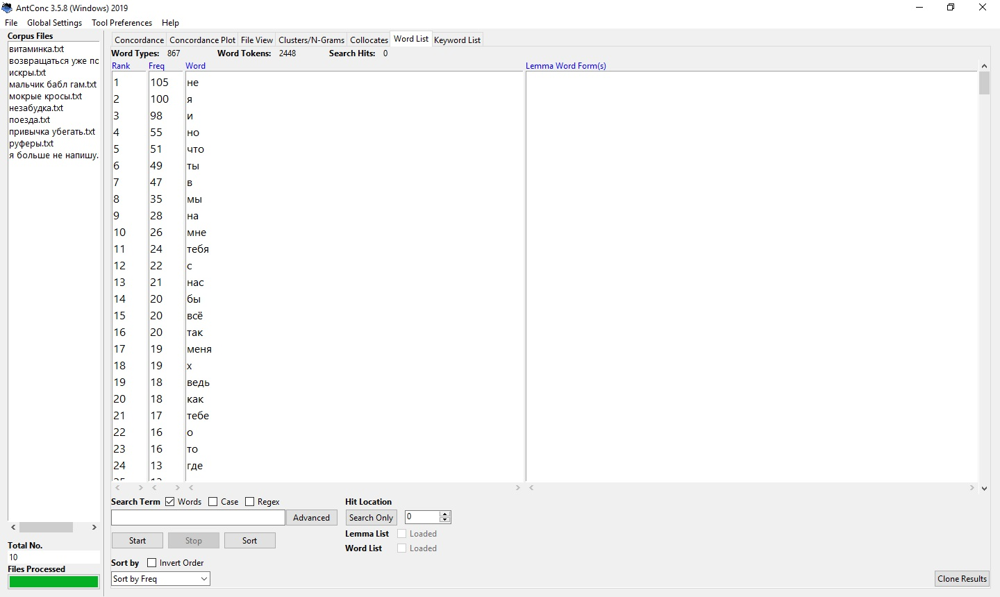
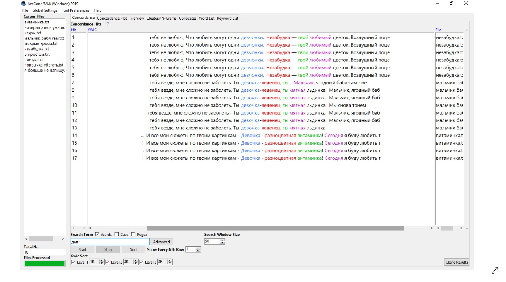
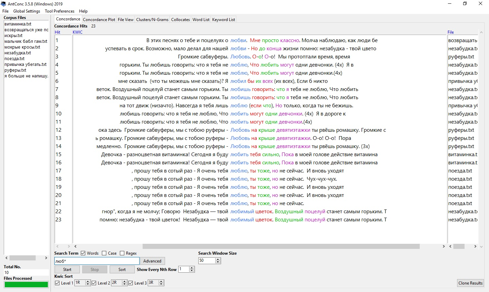
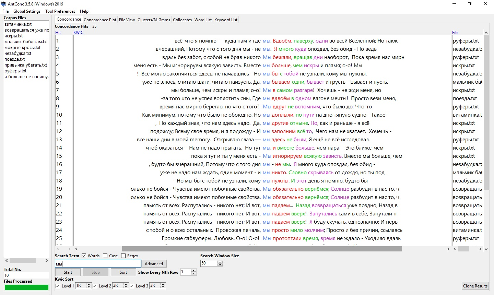
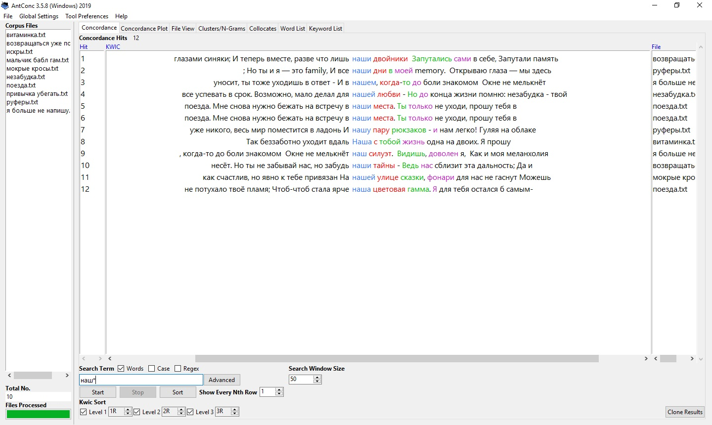
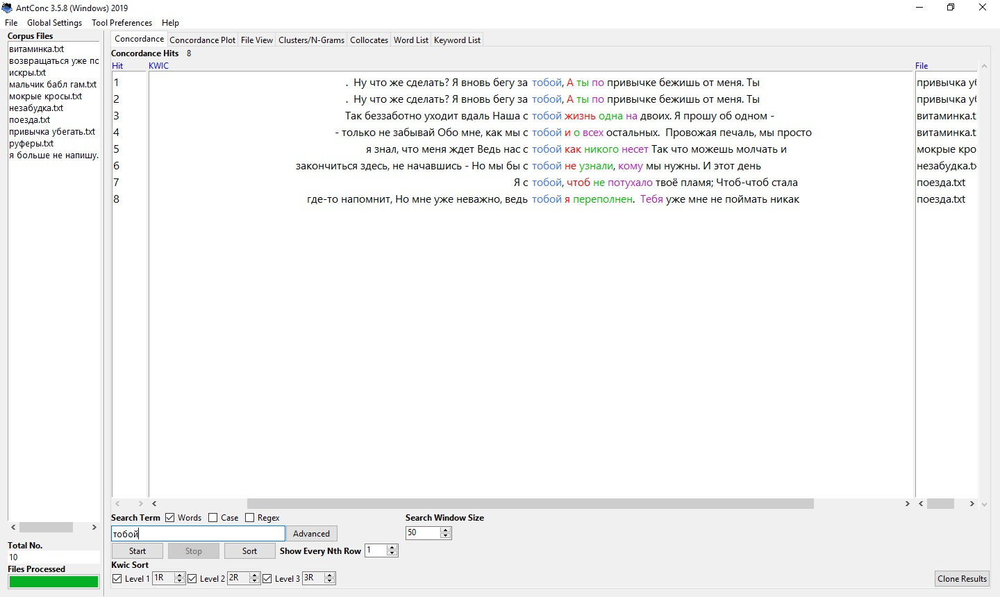
 
Как вы можете видеть, все слова связаны с отношениями. Обычно, это привлекают более юную аудиторию
 

### RusVectores

Следующим инструментом, которым мы воспользовались, является RusVectores. С помощью него мы посмотрели ассоциации двух самых популярных слов в песнях Тимы Белорусских. Это "девчонка" и "любовь". 
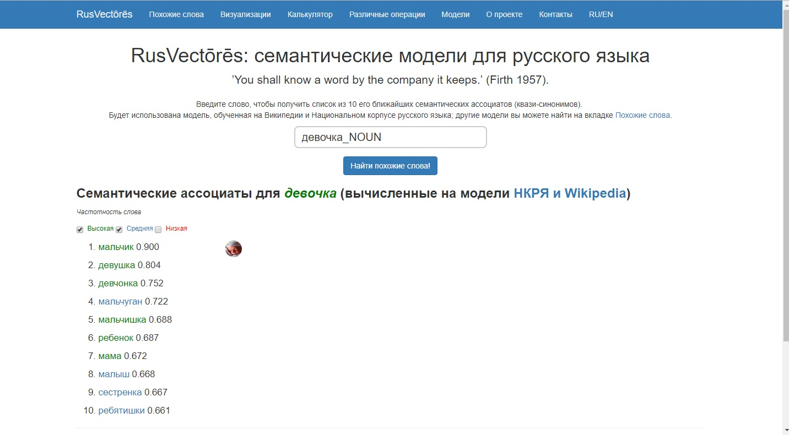
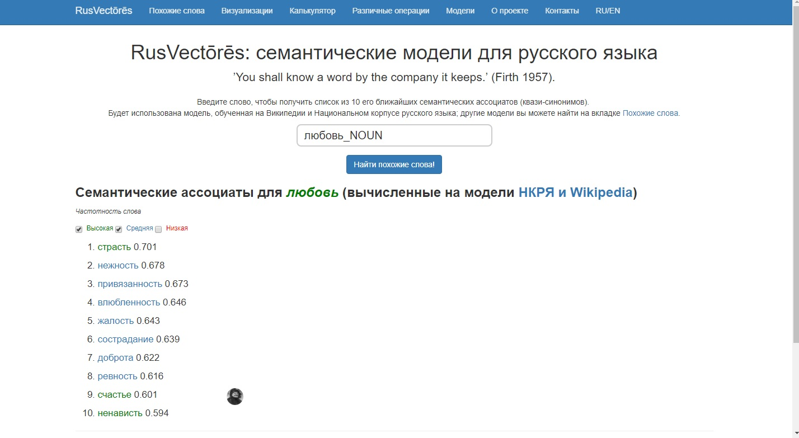

Это тот случай, когда ретромания сработала, как и требовалось — людям помладше его песни понравились на фоне репа, который, как мы уже сказали ранее, надоел. Образ «хорошего парня» в теории работает менее эффективно, чем рокстара-плохиша, но это в теории. А по факту на контрасте, например, с Элджем это, напротив, сыграло в плюс. Конец 2018-го — удивительное время, когда самым свежим оказался человек, который совсем не ругается матом и, например, употребляет в речи винтажно-ребяческое слово «девчонки».

### Voyant Tools

Последний инструмент - Voyant Tools. Для нас он оказалсы самыи красочным и интересным. Здесь мы 

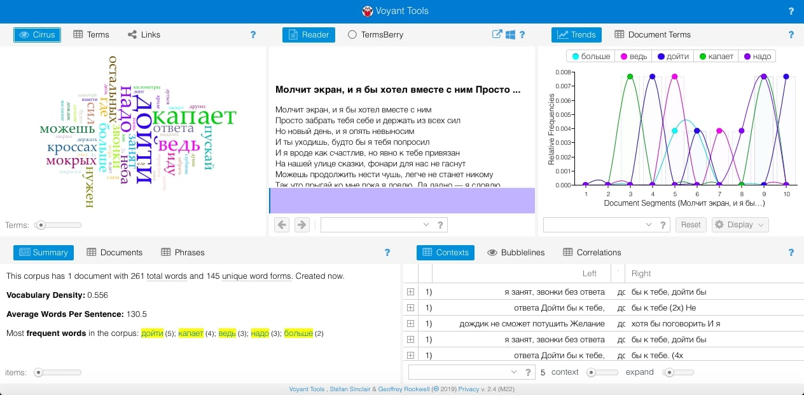
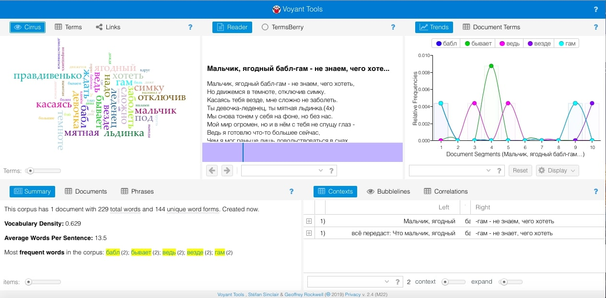
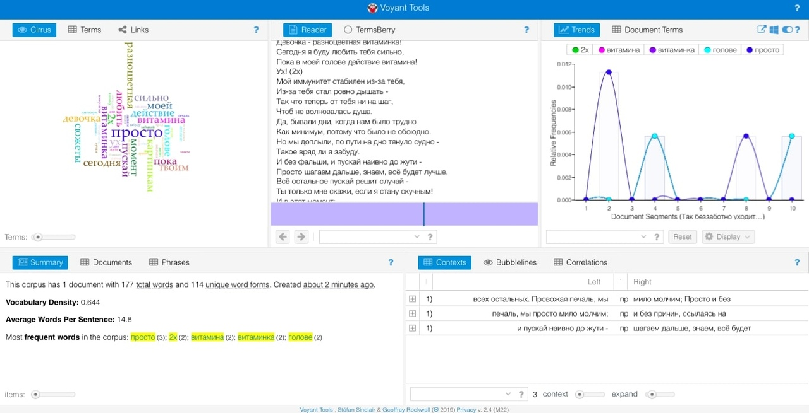
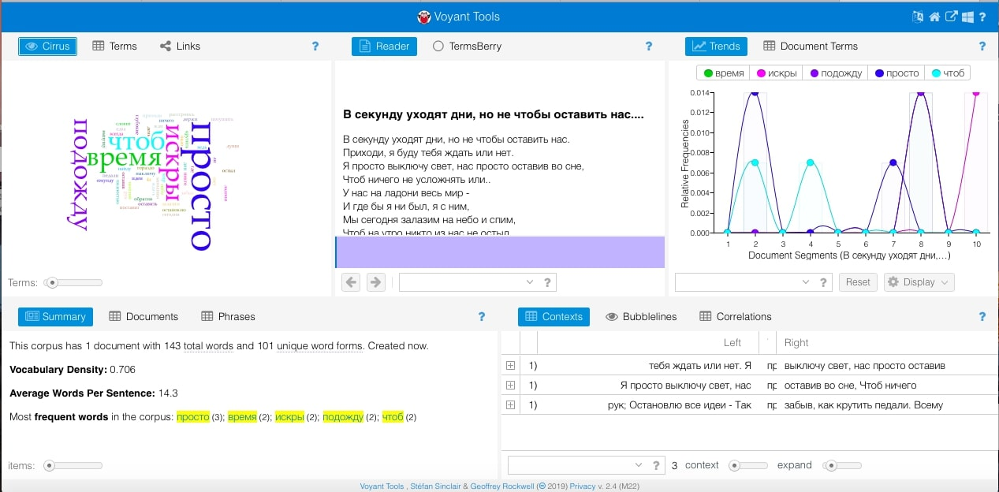
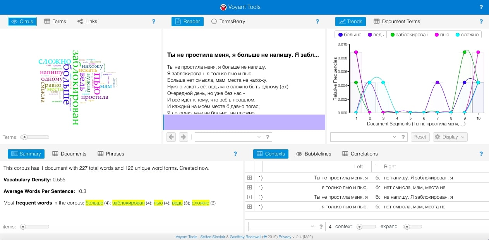
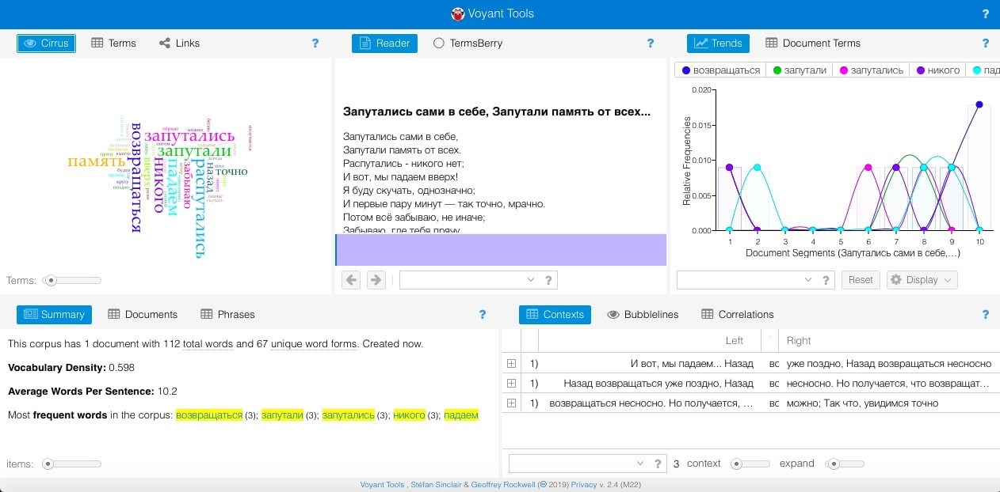
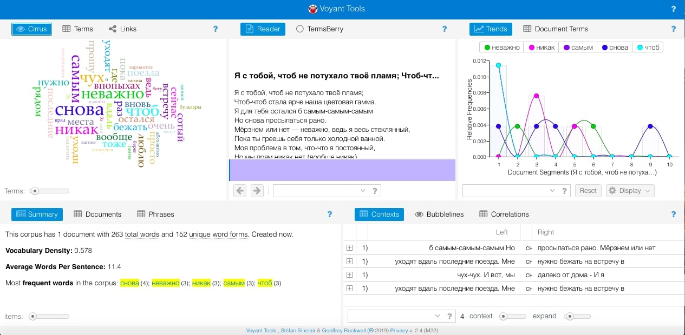

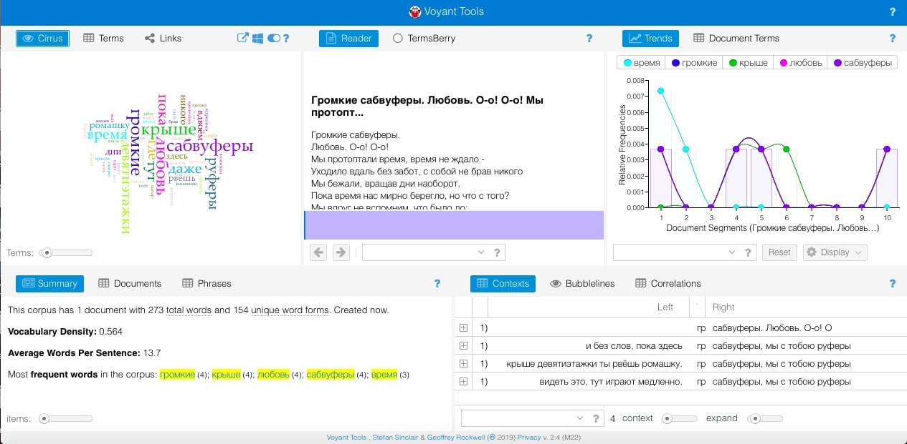
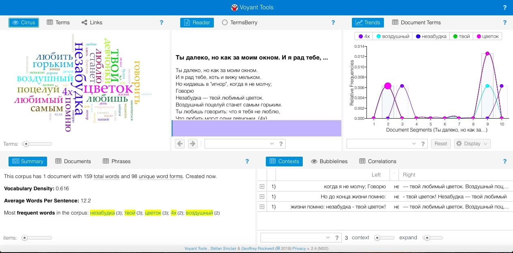

