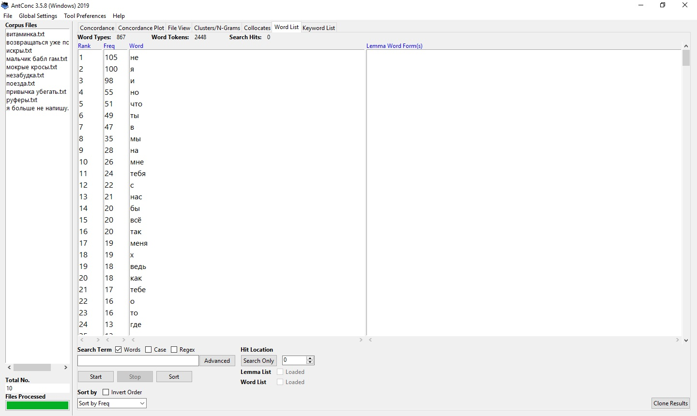

## Выявление самых популярных слов в песнях Тимы Белорусских

Свой проект мы решили сделать в рамках исследования текстов песен 20-летнего певца Тимы Белорусских, чьи треки буквально рвут все хит-парады. После релиза песни «Мокрые кроссы» в 2018 году Тима в одночасье стал популярным и завоевал сердца миллионов слушателей. А вышедшая спустя пару месяцев «Незабудка» лишь закрепила уже имеющийся успех. Безусловно, огромную роль играют отсылки певца к мотивам 90-ых. Молодежи зашли песни, потому что от хаус-репа уже давно все устали, ну а более взрослые полюбили треки исполнителя из-за теплых воспоминаний о настоящем звучании прошлого. Однако нам также показалось интересным проанализировать текст наиболее известных музыкальных композиций певца. По результатам анализа мы сможем определить частотные слова, которые делают песни популярными.

### AntConc
 Первый инструмент, который мы взяли, стал AntConc. Мы загрузили 10 самых популярных песен в AntConc и посмотрели часто используемые слова. Вот, что у нас получилось:
 
 

 

### Jekyll Themes

Your Pages site will use the layout and styles from the Jekyll theme you have selected in your [repository settings](https://github.com/ksmhlv/Project/settings). The name of this theme is saved in the Jekyll `_config.yml` configuration file.

### Support or Contact

Having trouble with Pages? Check out our [documentation](https://help.github.com/categories/github-pages-basics/) or [contact support](https://github.com/contact) and we’ll help you sort it out.
